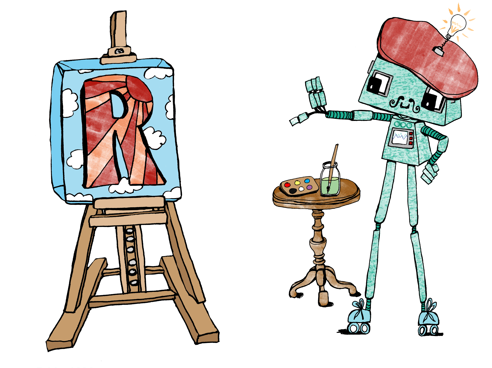
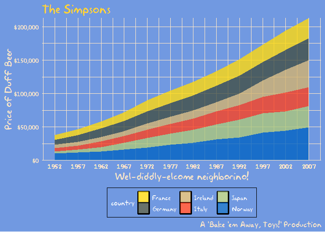

```{r setup, include=FALSE, message=FALSE}
options(htmltools.dir.version = FALSE)
library("jrPresentation")
set_presentation_options(url = "http://bit.ly/nhs-ggplot2")
knitr::opts_chunk$set(cache = FALSE)
```

layout:true
`r add_border(inverse=FALSE)`

---

# Introduction to {ggplot2}

* http://bit.ly/nhs-ggplot2

.center[
</img>
]

---

layout:true
`r add_border(inverse=FALSE)`

---
background-image: url(assets/white_logo.png)
class: center, middle, inverse

# Who am I?

---

layout: true
`r add_border(inverse=FALSE)`

---

# Jumping Rivers

.pull-left[
</img>
]


.pull-right[


* On-site training

* R and python consultancy

* Dashboard creation

* Code review

* Questionnaire design

* R Package development

* Predictive analytics

* Grant applications
]

---

# Our clients

<div id="clients">
</img></img>
</img></img>
</img></img>
</img></img>
</img></img>
</div>

---

# Introduction

*  _Many_ different ways to make graphs in R

* {ggplot2} started in 2005 and follows the "Grammar of Graphics" 

* Many companies have adopted {ggplot2} for graphics, including the [BBC](https://bbc.github.io/rcookbook/) and the [FT](https://twitter.com/jburnmurdoch)

* Think about graphics in terms of [layers](https://evamaerey.github.io/ggplot_flipbook/ggplot_flipbook_xaringan.html)

.center[
</img>
]

---

# The basic plot object

* Load the package with 
```{r message=FALSE}
library("ggplot2")
```

* Create an initial ggplot object, using `ggplot()`

* This function has two arguments:

* __data__: this must be a data frame (or tibble)

* an aesthetic __mapping__: this tells {ggplot2} how to map data to the graphical elements

---

# Setting up the plot

```{r}
movies = readRDS("data/movies.rds")
```

* The function `aes()` maps our data to the graph

* Here, duration is mapped to the x-axis

```{r, echo = TRUE}
g = ggplot(data = movies,
           mapping = aes(x = duration, y = rating))
```

Notice we can store graphs in variables.

---

# Scatter plots

* To add information we need to add a `geom`.
* Can have multiple `geoms` on a graph

```{r}
h = ggplot(movies, aes(x = duration, y = rating))
h + geom_point()
```

---

# Bar charts

* Great for displaying qualitative data.
* Length of the bar represents the frequency

```{r}
ggplot(movies, aes(x = classification)) + 
  geom_bar()
```

---

# Histograms

* Good for plotting continuous variables.
* Data is split up into intervals called `classes`.
* Area of the columns represent the frequencies in the classes.

```{r}
ggplot(movies, aes(x = duration)) + geom_histogram(binwidth = 10)
```

---

# Box and whisker plots

* Central bar represents the median

* Top and bottom of the box represents the lower and upper quartiles


```{r }
(b = ggplot(movies, aes(x = classification, y = rating)) + 
   geom_boxplot())
```

---

# Titles and legends

```{r labels, fig.margin = TRUE, fig.cap = "A boxplot graph with informative labels."}
b + labs(x = "Movie classification", 
         y = "User rating (1-10)", 
         title = "Movie ratings conditional on classification", 
         subtitle = "Data collected from the IMDB", 
         caption = "These box plots represent etc etc")
```

---

# Saving graphs to files

* So how do you save all your fantastic plots?

* RStudio has the *export* button

* It's also possible to export using code (better for reproducibility)

---
layout: true
`r add_border(inverse = TRUE)`

---

class: center, middle, inverse
background-image: url(assets/white_logo.png)
background-size: cover

# Practical

---
layout: true
`r add_border(inverse= FALSE)`
---

# Aesthetics

There are many different types of aesthetics

* Colour/fill `r emo::ji("paint")`

* Shape `r emo::ji("small_red_triangle")`

* Size `r emo::ji("elephant")`

* Linetype `r emo::ji("pencil2")`

* Alpha `r emo::ji("ghost")`


---

# Colours

```{r}
ggplot(movies, aes(x = duration, y = rating)) + 
  {{  geom_point(aes(colour = duration)) }}
``` 

---

# Aesthetics

```{r}
ggplot(movies, aes(x = duration, y = rating)) + 
  {{  geom_point(aes(colour = classification)) }}
``` 

---

# Aesthetics

```{r}
ggplot(movies, aes(x = duration, y = rating)) + 
  {{  geom_point(aes(colour = "Blue")) }}
``` 

---

# Aesthetics

```{r}
ggplot(movies, aes(x = duration, y = rating)) + 
  {{  geom_point(colour = "Blue") }}
``` 

---

# Remember! `r emo::ji("warning")`

## Inside aes():

Using columns of the data to style. E.g. `aes(colour = classification)`

## Outside aes():

Fixed styling. E.g. `colour = "blue"`

---

# Shapes

```{r shapes, echo = FALSE}
shapes <- data.frame(
  shape = c(0:19, 22, 21, 24, 23, 20),
  x = 0:24 %/% 5,
  y = -(0:24 %% 5)
)
ggplot(shapes, aes(x, y)) + 
  geom_point(aes(shape = shape), size = 5, fill = "red") +
  geom_text(aes(label = shape), hjust = 0, nudge_x = 0.15) +
  scale_shape_identity() +
  expand_limits(x = 4.1) +
  theme_void()
```

---

# Change shape for *all* points

```{r}
ggplot(movies, aes(x = duration, y = rating)) + 
  {{geom_point(shape = 9, size = 3)}}
``` 

---

# Change shape based on the data

```{r}
ggplot(movies, aes(x = duration, y = rating)) + 
  {{geom_point(aes(shape = classification), size = 3)}}
``` 

---

# Facets - mini plots!

```{r, tidy=FALSE, warning=FALSE, out.width="90%"}
ggplot(movies, aes(x = duration)) + 
  geom_histogram(binwidth = 10) +
  facet_wrap(~classification)
``` 

---

# Themes

```{r echo=FALSE}
bond = readRDS("data/bond.rds")
g = ggplot(bond, aes(Kills, Alcohol_Units)) + 
  geom_point(aes(colour = Actor)) + guides(colour = FALSE) + 
  theme_bw() 
```
 * Quick and easy way to add style to your plots.
 * Eight in-built themes with **ggplot2**
 
```{r}
ggplot(bond, aes(Kills, Alcohol_Units)) + 
  geom_point(aes(colour = Actor)) +
  theme_bw() 
```

---

# Other themes: ggthemes

```{r, fig.keep="none"}
library("ggthemes")
g + theme_excel() + scale_colour_excel()
g + theme_minimal() + scale_color_ptol()
g + theme_hc() + scale_colour_hc()
```
```{r echo=FALSE, out.width="70%"}
gridExtra::grid.arrange(
  g + theme_excel() + scale_colour_excel(),
  g + theme_minimal() + scale_color_ptol(),
  g + theme_hc() + scale_colour_hc(), nrow = 1)
```

---

# Other themes: hrbrthemes

See https://github.com/hrbrmstr/hrbrthemes

```{r, message=FALSE, echo=FALSE, warning=FALSE, out.width="100%"}
library("hrbrthemes")
g = ggplot(bond, aes(Kills, Alcohol_Units)) + 
  geom_point() + 
  ylim(c(0, 30))

g1 = g + theme_ipsum() +
  labs(x = "Kills", y = "Alcohol (Units)",
       title = "The Bond data set",
       subtitle = "Kills versus Alcohol consumption",
       caption = "The name's Bond, James Bond") 
```

```{r, message=FALSE, echo= FALSE, warning=FALSE, out.width="100%"}
gridExtra::grid.arrange(g, g1, ncol = 2)
```

---

# Other themes: {tvthemes}

You can even style your plot based on yout favourite TV show with [{tvthemes}](https://ryo-n7.github.io/2019-05-16-introducing-tvthemes-package/)

<center>
</img>
</center>

---
class: center, middle, inverse
background-image: url(assets/white_logo.png)
background-size: cover

# Practical

---

# Top troubleshooting tips `r emo::ji("tipping_hand_woman")`

* {ggplot2} is the `r emo::ji("package")`,  `ggplot()` is the function

* `colour = "blue"` vs `aes(colour = gender)`

* Round brackets! Geoms are functions. E.g. `geom_point()`

* Remember the `+`

* Are you plotting something sensible (is your data categorical?)

* Try manipulating your data **before** plotting it

* `r emo::ji("bar_chart")` Just `x` - `geom_bar()`, `x` and `y` - `geom_col()`

---

# Links & resources `r emo::ji("books")`

* [R4DS book chapter 3](https://r4ds.had.co.nz/data-visualisation.html)
* [R graphics cookbook](http://www.cookbook-r.com/Graphs/)
* [RStudio {ggplot2} cheatsheet](https://rstudio.com/resources/cheatsheets/)
* [#TidyTuesday](https://github.com/rfordatascience/tidytuesday)
* [Our training courses](https://www.jumpingrivers.com/training/all-courses/)

Share any cool plots you make on twitter!

@jumping_uk @trianglegirl #NHSR #NHSRconf2020

<center>
</img>
</center>


